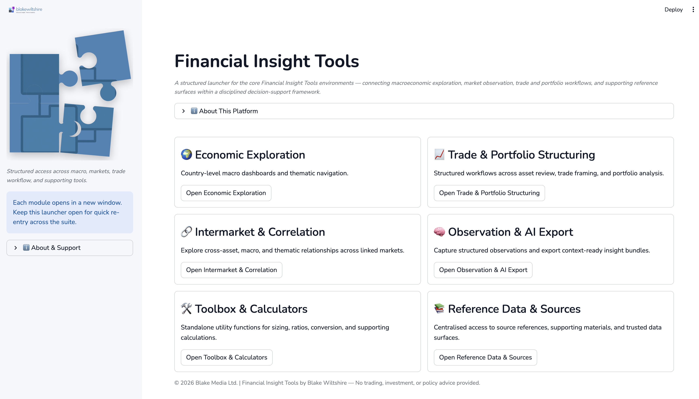
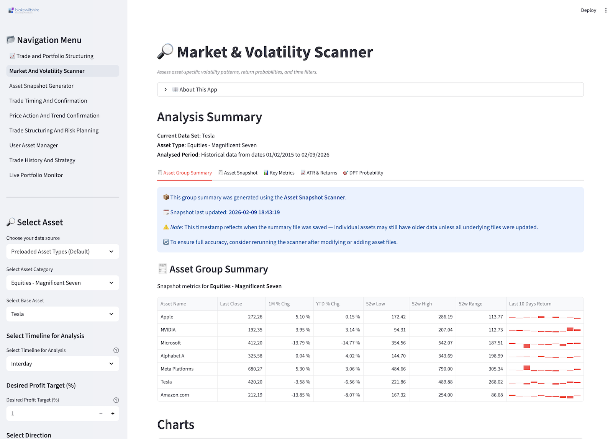
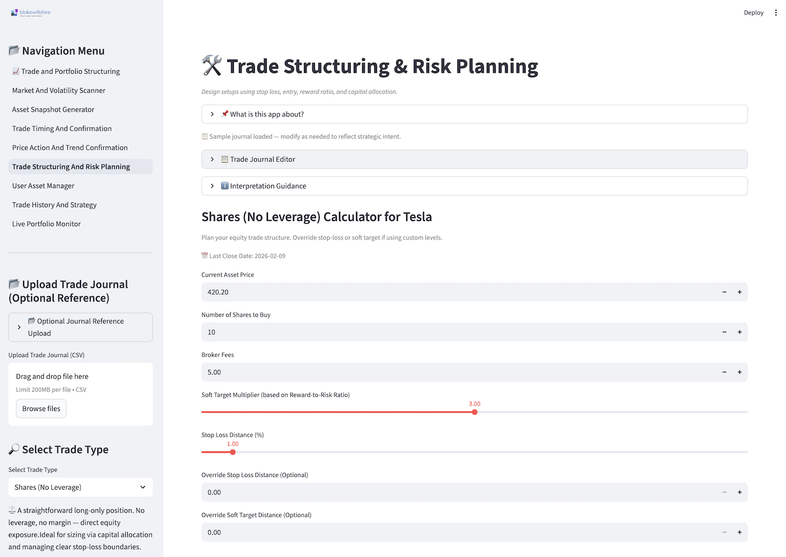
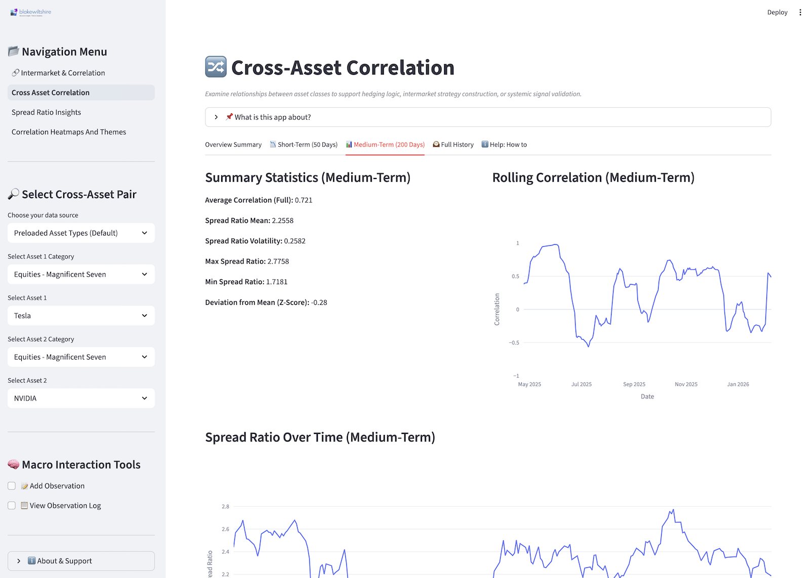
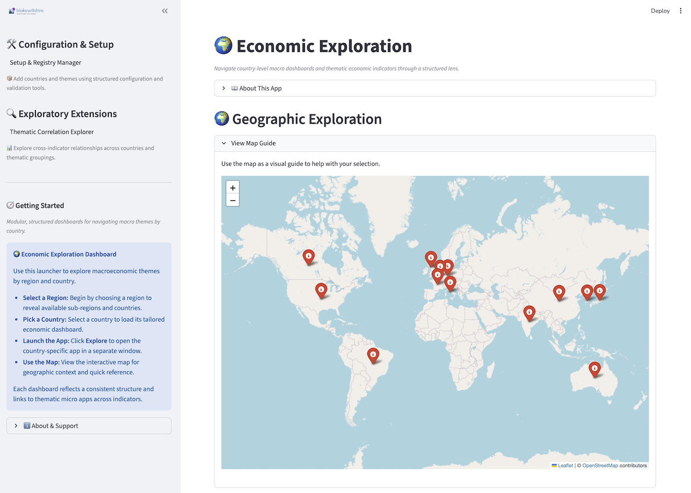
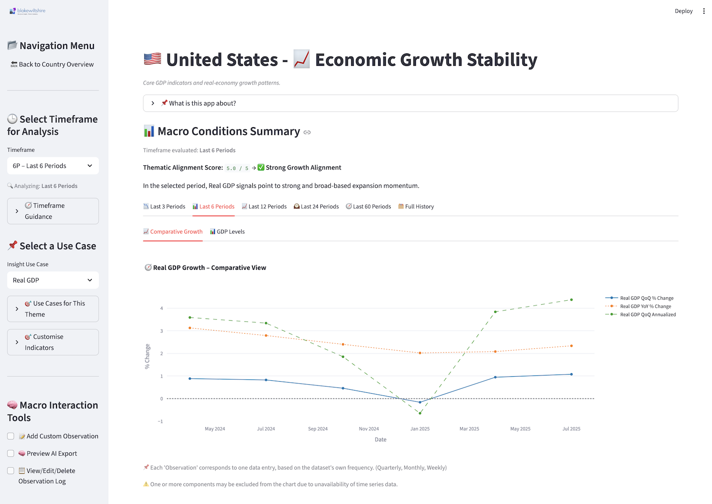
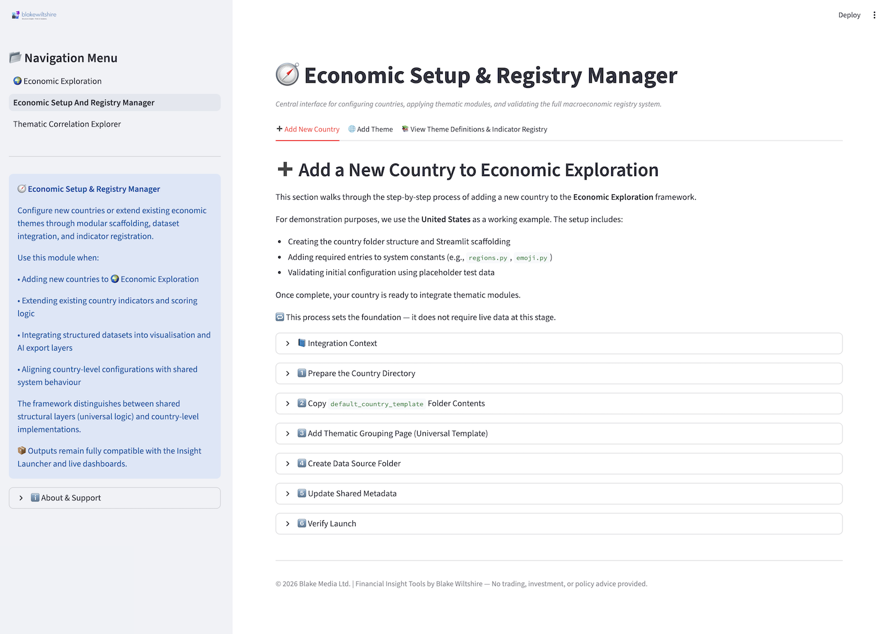
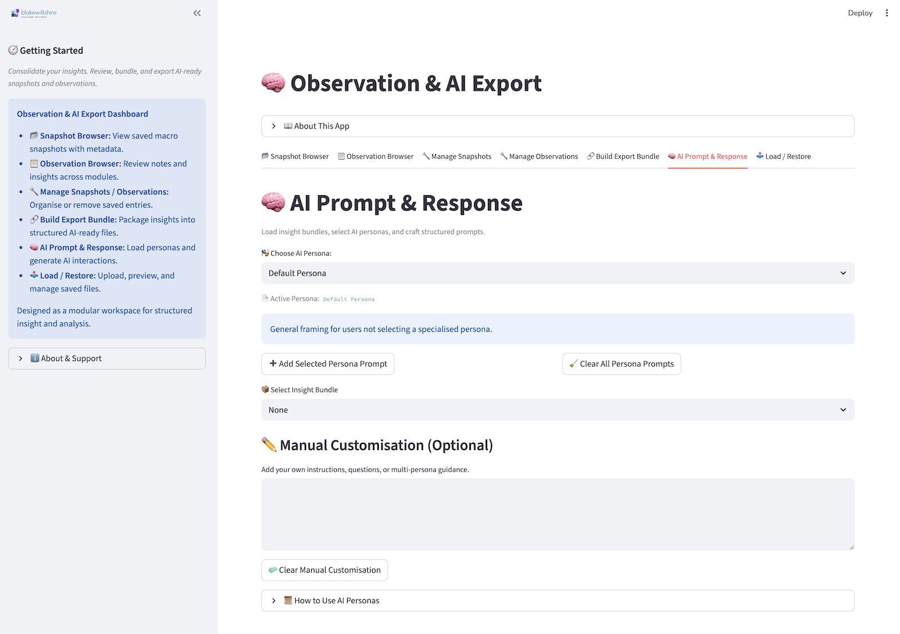

# Financial Insight Tools (FIT) — Structured Financial Reasoning Environment

Financial Insight Tools (FIT) is a modular research environment for exploring financial markets, macroeconomic structure, portfolio construction, cross-asset relationships, and structured decision workflows through a consistent analytical model.

FIT provides consistent structure across distribution analysis, trade modelling, macroeconomic exploration, correlation mapping, and observation capture so that material can be examined, aligned, and carried forward into documentation, research workflows, or AI-assisted reasoning environments.

---

## Companion References (PDF)

FIT includes companion documents under `docs/`:

- *Crafting Financial Frameworks — Modular, AI-Ready Systems for Structured Decision Support*  
- *Financial Insight Tools — Unified Index & Glossary Reference*

These documents provide architectural framing and consolidated reference material.  
Note: GitHub’s in-browser PDF preview may not render complex code-block formatting reliably; download for the best viewing experience.

---

## Python Version

Tested on 3.12.x

---

## Quick Start

### 1. Clone

```bash
git clone https://github.com/blakewiltshire/financial-insight-tools.git
cd financial-insight-tools
```

### 2. Create a Virtual Environment

```bash
python3 -m venv .venv
```

If `python3` is not available on your system, try:

```bash
python -m venv .venv
```

### 3. Activate the Environment

**macOS / Linux**

```bash
source .venv/bin/activate
```

**Windows (PowerShell)**

```powershell
.\.venv\Scripts\Activate.ps1
```

**Windows (cmd)**

```bat
.\.venv\Scripts\activate.bat
```

### 4. Install Requirements

```bash
python -m pip install --upgrade pip
pip install -r requirements.txt
```

### 5. Run the Application

```bash
streamlit run app.py
```

The application will launch at:

http://localhost:8501

---

## What This Is (and Isn’t)

**Is:**  
A structured, modular environment for examining financial data, macroeconomic indicators, portfolio behaviour, trade scenarios, and cross-asset relationships through consistent analytical scaffolds.

**Isn’t:**  
A brokerage platform, automated trading system, signal engine, portfolio manager, advisory service, or predictive model. FIT does not execute trades, provide financial advice, or generate investment recommendations.

All outputs are structural and exploratory in nature.

---

## Screenshots

### 🧭 Unified Launcher — Structural Orientation



The unified launcher presents FIT’s modular architecture and clarifies:

- The analytical domains available  
- How modules interrelate  
- Where configuration and export functions reside  
- Where to begin  

This is the orientation layer before moving into structured analysis.

---

### 📊 Market & Volatility Scanner — Distribution Backbone



The market scanner surfaces distribution structure and volatility context, including:

- Frequency and dispersion metrics  
- Shape characteristics  
- Regime-sensitive return framing  
- Structural probability context  

This module establishes quantitative grounding for downstream modelling.

---

### 🛠 Trade Structuring & Risk Planning — Position Architecture



Trade structuring provides scenario-based modelling of:

- Entry and stop logic  
- Exposure calibration  
- Position sensitivity  
- Risk framing within defined parameters  

This module supports disciplined analytical evaluation without automating execution.

---

### 🔗 Cross-Asset Correlation — Relationship Mapping



The correlation dashboard presents cross-asset and thematic relationships through structured heatmaps and comparative views, enabling examination of regime alignment and structural interdependence.

---

### 🌍 Economic Exploration — Macro Landscape



Economic Exploration enables country-level macroeconomic analysis through structured indicator selection and global mapping across growth, inflation, labour, trade, and structural themes.

---

### 🇺🇸 Country Deep Dive — Indicator Drill-Down



Focused jurisdictional analysis (e.g., GDP, inflation, labour dynamics) presents structured macroeconomic detail within a single country context.

---

### 🧭 Setup & Registry Manager — Configuration Backbone



The configuration layer governs indicator selection, registry mappings, and structural consistency across modules, preserving coherence throughout the environment.

---

### 🤖 Build Export Bundle — Structured Artefact Assembly



The export module organises analytical components into structured bundles suitable for documentation, research artefacts, or AI-assisted interpretation workflows.

Exports preserve linkage to the underlying analytical structure.

---

## Where to Start

- **Market & Volatility Scanner** — distribution and regime context  
- **Trade Structuring & Risk Planning** — scenario modelling  
- **Economic Exploration** — macro landscape analysis  
- **Cross-Asset Correlation** — relationship mapping  
- **Observation & Export** — structured artefact assembly  

Each module presents a different perspective on the same underlying analytical framework without fragmenting or redefining it.

---

## Structure (High-Level)

```
financial-insight-tools/
  apps/          # Modular application domains
  core/          # Shared structural logic and helpers
  constants/     # Configuration and registry mappings
  docs/          # Reference documentation
  templates/     # Custom templates
  brand/         # Visual assets
  data/          # Optional local datasets
  images/        # Application images
  app.py         # Streamlit launcher
  LICENSE
  requirements.txt
  README.md
```

Canonical resources live alongside the modules that use them.  
Generated artefacts are produced locally during use.

---

## Updating & Extending FIT

### Updating the Framework

Updates to Financial Insight Tools are distributed through the Git repository.

From the project root:

```bash
git pull
```

Only files that have changed in the repository will be updated locally.

Regular updates include:

- Weekly historical asset data refreshes (financial datasets)
- Periodic macroeconomic data updates
- Refinements to shared universal configuration layers
- Module-level enhancements where applicable

If you have modified local files, commit or back them up before pulling updates to avoid merge conflicts.

After pulling updated historical asset data, rerun the **Asset Snapshot Scanner** to regenerate summary outputs where applicable.

---

### Universal and Country Layers

FIT uses a layered configuration model.

**Universal files** define shared behaviour across the system:

- `universal_indicator_map`
- `universal_insights`
- `universal_routing`
- `universal_scoring_weights_labels`
- `universal_use_cases`
- `universal_visual_config`

These files establish common structural logic and may be updated as the framework evolves.

**Country-level files** define jurisdiction-specific implementations:

- `indicator_map`
- `insights`
- `routing`
- `scoring_weights_labels`
- `use_cases`
- `visual_config`

If extending the system with additional indicators or jurisdictions, implement changes at the country level first.

If a new indicator requires shared scoring, routing, or visual logic across the system, corresponding updates may also be required in the universal layer.

---

### Data Update Policy

- Historical financial asset datasets are refreshed on a regular cadence.
- Macroeconomic datasets are updated as new releases become available.
- Updates modify canonical data files under `apps/data_sources/...`.

Local artefacts (exports, snapshots, observations) are not modified by repository updates.

---

FIT is designed as an open, extensible system. Users may extend or adapt the framework as required. Structural coherence is maintained by preserving the distinction between universal layers and local implementations.

---

## License & Use

Free to read and use as provided.

All outputs are structural and exploratory in nature.  
No advisory, brokerage, portfolio management, or automated trading services are provided.

Refer to LICENSE for details.

---

## Ecosystem Context

Financial Insight Tools forms part of a broader independent framework studio exploring complex systems through structured guides, modular tools, and applied insight.

FIT aligns with the architectural concepts presented in the *Navigating the World of Economics, Finance, and Markets* series — a structured examination of economics and finance as interconnected systems shaped by institutions, incentives, coordination mechanisms, and technological change.

The series spans six thematic areas: Foundational Knowledge, Practical Economics, Finance Fundamentals, Investment Strategies, Trading and Operations, and FinTech Innovations. Together, these areas provide a coherent framework for understanding macroeconomic structure, market dynamics, portfolio construction, and system-level behaviour.

Each guide functions as a self-contained analytical unit while aligning to a broader modular architecture that supports structured reasoning, comparative analysis, and cross-domain exploration.

Financial Insight Tools operationalises elements of this framework in an applied research environment. The application can be used independently; the guides provide deeper architectural framing for those exploring the underlying structural model.

Further context:  
www.blakewiltshire.com

---

Financial Insight Tools by Blake Wiltshire  
© Blake Media Ltd.
