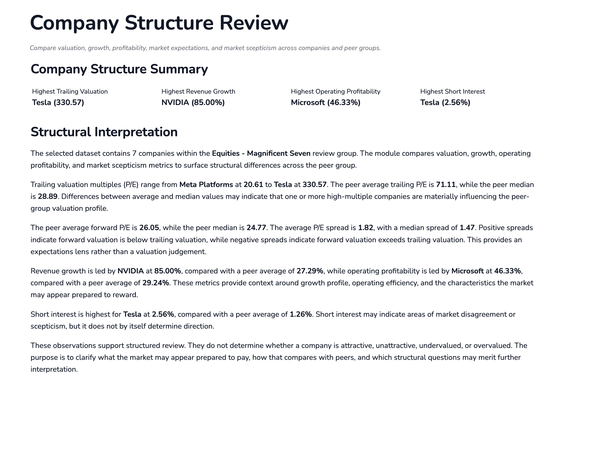
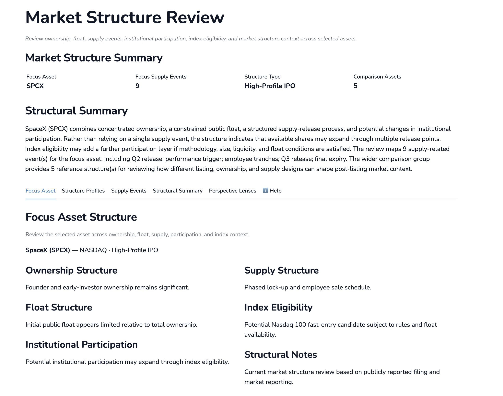
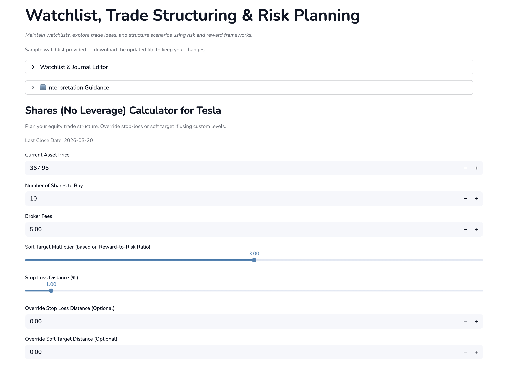
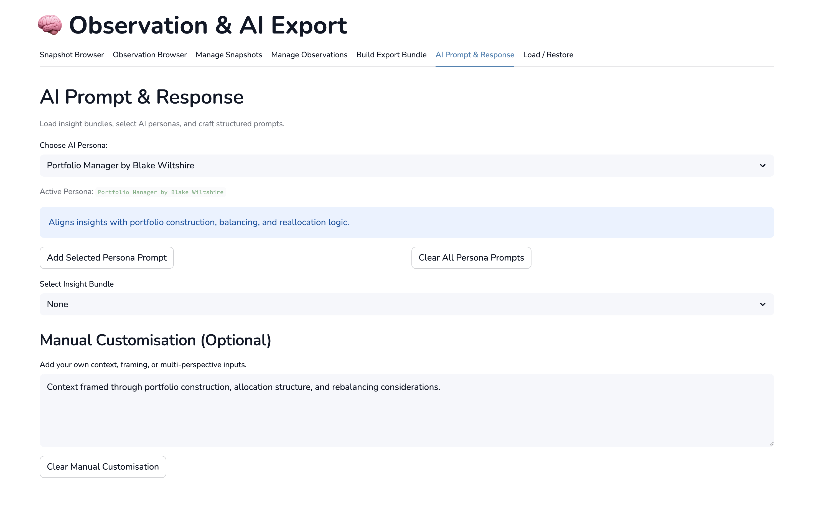

# Financial Insight Tools (FIT) — Structured Financial Reasoning Environment

Financial Insight Tools (FIT) is a modular decision-support environment for building structured investigations across financial markets, macroeconomics, company analysis, and related analytical domains. Observations, evidence, and reasoning remain connected as investigations evolve, allowing context to develop alongside new information. AI contributes through structured investigation review while human judgement remains central to interpretation and decision-making.

FIT provides consistent structure across relationship exploration, distribution analysis, trade modelling, macroeconomic exploration, thematic correlation, relative macro transmission, positioning analysis, company structure review, market structure review, and observation capture so that information can be organised, examined, aligned, and preserved as structured investigations that can be revisited, extended, documented, or reviewed through AI-assisted investigation workflows.

## Learn More

To understand the investigation philosophy behind Financial Insight Tools (FIT):

- [Why We Built Financial Insight Tools (FIT)](https://blakewiltshire.substack.com/p/financial-insight-tools-fit)

## Companion References (PDF)

FIT includes companion documents under `docs/`:

- *Crafting Financial Frameworks — Modular, AI-Ready Systems for Structured Decision Support*
- *Financial Insight Tools — Unified Index & Glossary Reference*

These documents provide architectural framing and consolidated reference material.

Note: GitHub’s in-browser PDF preview may not render complex code-block formatting reliably; download for the best viewing experience.

## Python Version

Python (tested on 3.12.x)

## Quick Start

### 1. Clone

```bash
git clone https://github.com/blakewiltshire/financial-insight-tools.git
cd financial-insight-tools
```

### 2. Create a Virtual Environment

```bash
python3 -m venv .venv
```

If `python3` is not available on your system, try:

```bash
python -m venv .venv
```

### 3. Activate the Environment

**macOS / Linux**

```bash
source .venv/bin/activate
```

**Windows (PowerShell)**

```powershell
.\.venv\Scripts\Activate.ps1
```

**Windows (cmd)**

```bat
.\.venv\Scripts\activate.bat
```

### 4. Install Requirements

```bash
python -m pip install --upgrade pip
pip install -r requirements.txt
```

### 5. Run the Application

```bash
streamlit run app.py
```

The application will launch at:

http://localhost:8501

## What This Is (and Isn’t)

**Is:**  
A structured, modular environment for examining financial data, macroeconomic indicators, portfolio behaviour, trade scenarios, cross-market relationships, and system-level interaction through consistent analytical scaffolds.

**Isn’t:**  
A brokerage platform, automated trading system, signal engine, portfolio manager, advisory service, or predictive model. FIT does not execute trades, provide financial advice, or generate investment recommendations.

All outputs are structural and exploratory in nature.

## Platform Architecture

FIT is structured across connected analytical layers.

### System Foundation

- Economic Exploration
- Thematic Correlation
- Relative Macro Transmission
- Positioning & Crowding

### Relationship & Investigation

- Relationship Manager
- Reference & Investigation Resources

### Financial Application

- Market & Volatility Scanner
- Company Structure Review
- Market Structure Review
- Asset Snapshot Generator
- Trade Timing & Confirmation
- Price Action & Trend Confirmation
- Watchlist, Trade Structuring & Risk Planning
- Spread Ratio Insights
- Cross-Asset Correlation
- Live Portfolio Monitor

### Investigation Preservation

- Observation & AI Export

### Utilities

- Kelly Criterion
- VaR Calculator
- Compounding Calculator
- Standard Deviation Calculator
- Historical Data Currency Converter
- Data Cleaner & Inspector

## Screenshots

### Unified Launcher — Structural Orientation


The unified launcher presents FIT’s modular architecture and clarifies:

- the analytical domains available
- how modules interrelate
- where configuration, observation, and export functions reside

This is the orientation layer before moving into structured analysis.

### Economic Exploration — Macro System View


A structural view across macroeconomic conditions and country-level indicators:

- growth, inflation, labour, and trade signals
- thematic grouping and indicator structure
- cross-country comparison and aggregation
- system-level economic context

Provides the macro foundation for downstream analytical workflows.

### Thematic Correlation — Relationship Mapping


A structural view across macroeconomic themes and systemic relationships:

- thematic clustering across economic indicators
- direct and inverse relationships
- macro alignment and divergence
- cross-country and cross-theme co-movement

This provides the relationship layer before transmission analysis.

### Relative Macro Transmission — Exogenous Differential Architecture


Tracks exogenous differentials across systems and how macro pressure transmits through markets:

- growth and inflation differentials
- interest rate and carry structures
- external balance and FX pressure
- sovereign, equity, and cross-market divergence

This moves beyond correlation into structural transmission analysis.

### Positioning & Crowding — Position Architecture


A structural view across leveraged positioning, percentile extremes, and market participation behaviour:

- Commitment of Traders (COT) positioning
- percentile extremes and crowding conditions
- positioning turns and reversal structures
- market overlay and regime interpretation

This provides the participant behaviour layer across major futures markets.

### Market & Volatility Scanner — Distribution Backbone


A structural view across market behaviour and volatility conditions:

- frequency and dispersion metrics
- shape characteristics
- regime-sensitive return framing
- structural probability context

Provides quantitative grounding for downstream modelling.

### Company Structure Review — Valuation & Business Structure



A structural view across valuation, profitability, efficiency, and business performance characteristics:

- valuation and earnings structure
- profitability and margin behaviour
- capital efficiency metrics
- comparative company analysis

Supports examination of how market pricing aligns with business performance, growth expectations, and operational characteristics.

### Market Structure Review — Ownership, Supply & Participation



A structural view across ownership, available supply, liquidity formation, and participation pathways:

- ownership and control structure
- float and supply-release conditions
- secondary supply events and lockup structures
- institutional participation and index-eligibility pathways

Supports review of how market access, tradable supply, and participation mechanisms may evolve through time.

### Watchlist, Trade Structuring & Risk Planning — Scenario Architecture



A structured environment for maintaining watchlists, developing trade ideas, and examining risk and reward scenarios.

- watchlist and idea management
- candidate asset tracking
- exposure and position planning
- scenario-based evaluation
- structured risk framing

Supports the progression from candidate assets to structured market investigation.

### Observation & AI Export — Investigation Workflow



Observation & AI Export consolidates Decision Support Snapshots, structured observations, Research Notes, and contextual metadata into portable investigation bundles. Investigations can then be reviewed through AI personas, preserved for future analysis, or restored as understanding develops.

## Where to Start

Investigations may begin from any module. Different analytical questions naturally lead to different investigation paths, while observations, evidence, and reasoning remain connected throughout the process.

### Markets & Companies

- **Market & Volatility Scanner** — distribution structure, volatility, and market behaviour
- **Company Structure Review** — valuation, profitability, efficiency, and comparative business analysis
- **Market Structure Review** — ownership, supply, participation, and liquidity structure

### Macroeconomic & System Exploration

- **Economic Exploration** — macroeconomic indicators and country-level diagnostics
- **Thematic Correlation** — relationships across macroeconomic themes
- **Relative Macro Transmission** — structural transmission between economies and markets
- **Positioning & Crowding** — leveraged positioning, percentile extremes, and market participation

### Trade Planning & Investigation

- **Trade Timing & Confirmation** — multi-timeframe alignment and confirmation
- **Price Action & Trend Confirmation** — trend, momentum, and directional structure
- **Trade Structuring & Risk Planning** — scenario planning, exposure, and risk calibration
- **Observation & AI Export** — preserve observations, assemble investigation bundles, and support AI-assisted review

## Structure (High-Level)

```text
financial-insight-tools/
  apps/          # Modular application domains
  core/          # Shared structural logic and helpers
  constants/     # Configuration and registry mappings
  docs/          # Reference documentation
  templates/     # Custom templates
  brand/         # Visual assets
  data/          # Optional local datasets
  images/        # Application images
  app.py         # Streamlit launcher
  LICENSE
  requirements.txt
  README.md
```

Canonical resources live alongside the modules that use them.  
Generated artefacts are produced locally during use.

## Updating & Extending FIT

### Updating the Framework

Updates to Financial Insight Tools are distributed through the Git repository.

From the project root:

```bash
git pull
```

Only files that have changed in the repository will be updated locally.

Regular updates include:

- Historical asset price datasets refreshed on a regular weekly maintenance cadence
- Weekly positioning and Commitment of Traders (COT) dataset updates
- Macroeconomic datasets updated as new releases become available
- Refinements to shared universal configuration layers
- Module-level enhancements where applicable

If you have modified local files, commit or back them up before pulling updates to avoid merge conflicts.

After pulling updated historical asset data, rerun the **Asset Snapshot Scanner** to regenerate summary outputs where applicable.

### Universal and Country Layers

FIT uses a layered configuration model.

**Universal files** define shared behaviour across the system:

- `universal_indicator_map`
- `universal_insights`
- `universal_routing`
- `universal_scoring_weights_labels`
- `universal_use_cases`
- `universal_visual_config`

These files establish common structural logic and may be updated as the framework evolves.

**Country-level files** define jurisdiction-specific implementations:

- `indicator_map`
- `insights`
- `routing`
- `scoring_weights_labels`
- `use_cases`
- `visual_config`

If extending the system with additional indicators or jurisdictions, implement changes at the country level first.

If a new indicator requires shared scoring, routing, or visual logic across the system, corresponding updates may also be required in the universal layer.

### Data Update Policy

- Historical financial asset datasets are refreshed on a regular cadence.
- Weekly positioning datasets are updated through Commitment of Traders (COT) releases.
- Macroeconomic datasets are updated as new releases become available.
- Updates modify canonical data files under `apps/data_sources/...`.

Local artefacts (exports, snapshots, observations) are not modified by repository updates.

FIT is designed as an open, extensible system. Users may extend or adapt the framework as required. Structural coherence is maintained by preserving the distinction between universal layers and local implementations.

## License & Use

Free to read and use as provided.

All outputs are structural and exploratory in nature.  
No advisory, brokerage, portfolio management, or automated trading services are provided.

Refer to LICENSE for details.

## Ecosystem Context

Financial Insight Tools forms part of a broader independent framework studio exploring complex systems through structured guides, modular tools, and applied insight.

FIT aligns with the architectural concepts presented in the *Navigating the World of Economics, Finance, and Markets* series — a structured examination of economics and finance as interconnected systems shaped by institutions, incentives, coordination mechanisms, and technological change.

The series spans six thematic areas: Foundational Knowledge, Practical Economics, Finance Fundamentals, Investment Strategies, Trading and Operations, and FinTech Innovations. Together, these areas provide a coherent framework for understanding macroeconomic structure, market dynamics, portfolio construction, and system-level behaviour.

Each guide functions as a self-contained analytical unit while aligning to a broader modular architecture that supports structured reasoning, comparative analysis, and cross-domain exploration.

The companion guides introduce the analytical frameworks and mental models that underpin the wider ecosystem. Triangular Navigation extends each guide through practical application, AI-assisted perspective testing, and decision-support tools. Financial Insight Tools provides the environment in which those concepts become structured investigations, preserving evidence, observations, and reasoning as understanding develops.

Financial Insight Tools operationalises these concepts within a structured investigation environment. The application can be used independently; the guides provide deeper architectural framing for those exploring the underlying structural model.

Further context:  
https://blakewiltshire.com

Financial Insight Tools by Blake Wiltshire  
© Blake Media Ltd.
